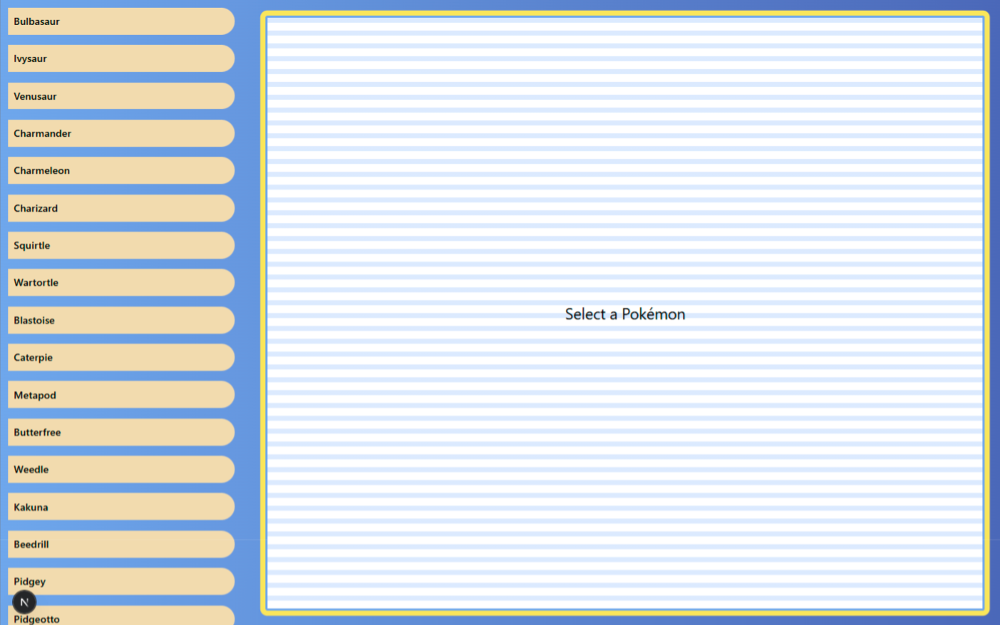

# Pokemon Website  
This is a solution for a personal project built using Next.js, TailwindCSS, and TypeScript to display Pokémon information interactively.  
It uses the [PokeAPI](https://pokeapi.co/) as the data source to fetch details about Pokémon in real time.

## Table of Contents
- [Overview](#overview)  
- [Links](#links)  
- [Technologies](#technologies)  
- [Clone this repository](#clone-this-repository)  
- [Author](#author)

## Overview  



## Technologies  
- Framework: Next.js 15  
- Styling: TailwindCSS 4  
- Language: TypeScript  
- Linter: ESLint  
- Bundler: Turbopack (via Next.js)

## Clone this repository

```bash
# Clone this repository
$ git clone https://github.com/TKadyear/pokemon-website.git

# Go into the project folder
$ cd pokemon-website

# Install dependencies
$ npm install

# Start the development server
$ npm run dev
````

To view the production server, run the following commands:

```bash
# Build the project for production
$ npm run build

# Start the production server
$ npm start
```

## Author

- GitHub - [TKadyear](https://github.com/TKadyear)
- LinkedIn - [Tamara Kadyear Saber](https://www.linkedin.com/in/tamara-kadyear-saber/)

